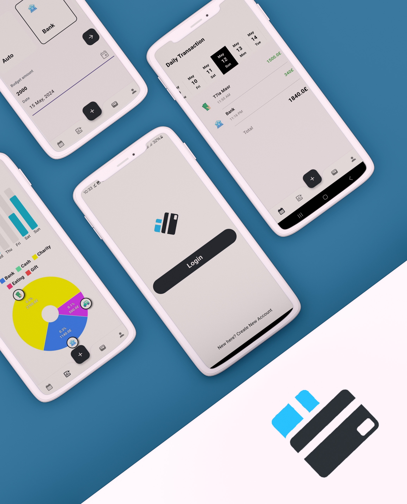
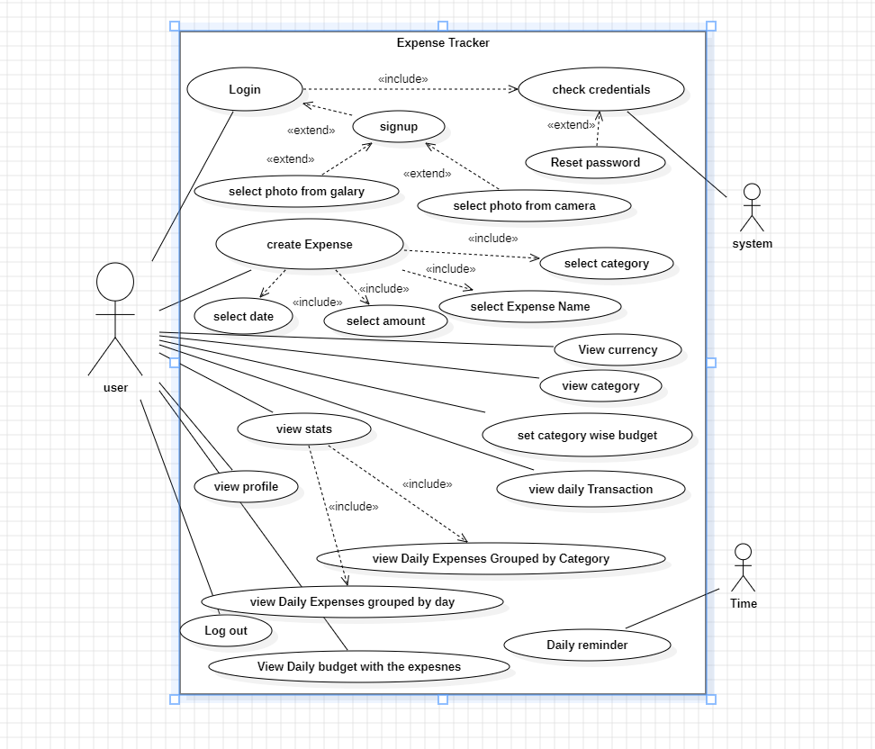
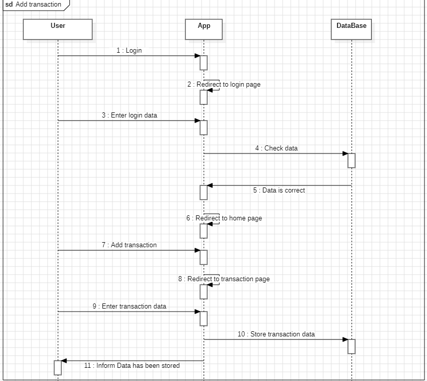
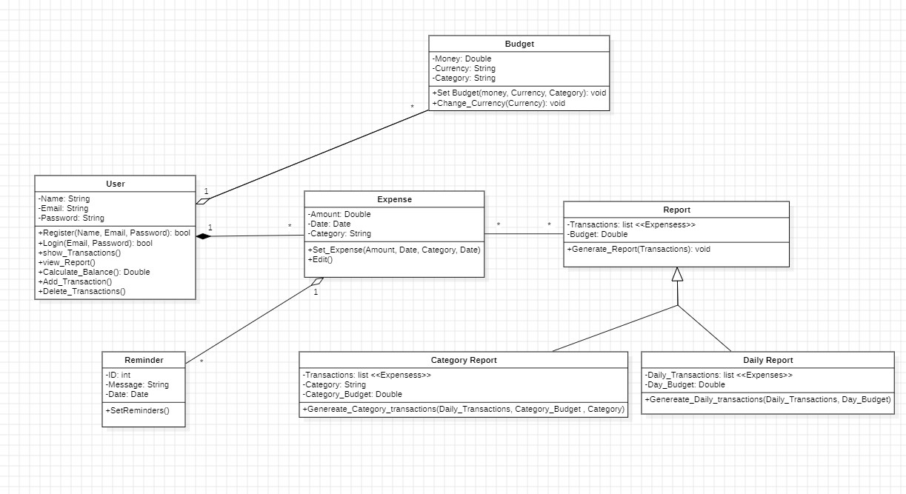

<div align="center">

  <h1> Expenseo - The Ultimate Expense Tracker</h1>
  
  <h3>  Expenseo is a personal expense manager built in flutter with firebase as database, It user firebase email pass auth for authentication and firestore as storage</h3>
  
  


</div>

## :star2: About The Project

- **Onboarding and Account Creation**: Simple and Intuitive onboarding process guiding users through the app's features.
- **Account Operations**: Photo Select from gallery and camera and crop as needed, and login with Credentials.
- **Forgot Password**: Forgot password functionality with email verification.

- **Daily Expenses Report**: Expenses are grouped by day with a sum total displayed, Pie chart visualization of daily expenses grouped by category.

- **Budget Tracking**: Display of daily budget with expenses shown as a ratio.

- **Push Notifications**: Notifications generated through Firebase Cloud.

## :chart_with_upwards_trend: Diagrams

Use Case Diagram: 



Sequence Diagram for add transaction: 



Class Diagram: 




## :space_invader: Built With

-   ![Flutter]
-   ![Firebase]
-   ![Figma]


## :toolbox: Installation

1. Clone the repo
    ```sh
    git clone https://github.com/Andrew-Ayman123/Flutter-Expenseo-Expense_Tracker.git
    ```
2. Install flutter depecndiceis  packages
    ```sh
    flutter packages get
    flutter packages upgrade
    ```
3. Run Build and run flutter app (debug version)
    ```sh
    flutter -v -d your_android_device run
    ```

[Flutter]: https://img.shields.io/badge/Flutter-%2302569B.svg?style=for-the-badge&logo=Flutter&logoColor=white

[Firebase]: https://img.shields.io/badge/firebase-%23039BE5.svg?style=for-the-badge&logo=firebase

[Figma]: https://img.shields.io/badge/figma-%23F24E1E.svg?style=for-the-badge&logo=figma&logoColor=white
